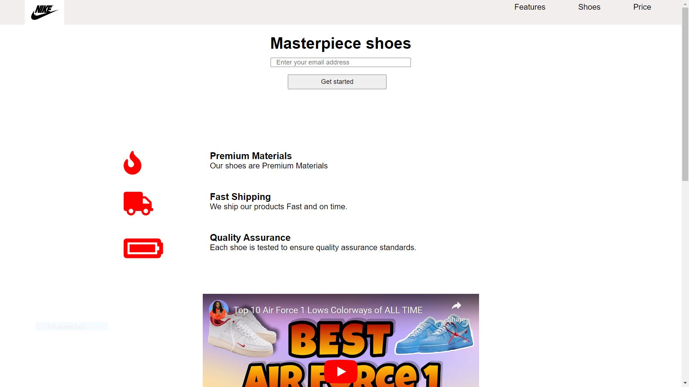
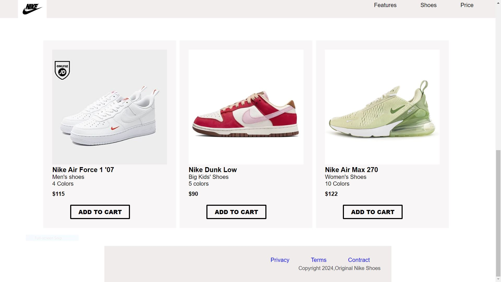

# Nike Shoes Product Landing Page

Welcome to the repository for the Nike Shoes Product Landing Page! This website is designed to showcase a selection of Nike's latest and most popular footwear. Built with HTML and CSS, this project demonstrates a clean, responsive design tailored to provide an engaging user experience.

## Project Overview

The Nike Shoes Product Landing Page features a modern design with an emphasis on simplicity and accessibility. The layout is responsive, ensuring the page looks great on devices of all sizes from desktops to smartphones. Users can explore different models of Nike shoes, learn more about their features, and find links to purchase them online.

### Features

- **Product Showcase**: Highlights several Nike shoe models with descriptions, prices, and high-quality images.
- **Responsive Design**: Adapts to various screen sizes for optimal viewing on mobiles, tablets, and desktops.
- **Navigation Bar**: Allows easy navigation across the landing page with smooth scrolling.

## Technologies Used

- **HTML**: Structures the web content.
- **CSS**: Styles the presentation, layout, and animations.

# Screenshoot




## Installation

To get a local copy up and running, follow these simple steps.

### Prerequisites

This project does not require any advanced prerequisites. However, having a modern web browser (such as Google Chrome, Mozilla Firefox, or Microsoft Edge) installed on your device will allow you to view the page as intended.

### Setup

1. Clone the repo

   ```sh
   git clone https://github.com/leulx1/Nike-Product-Landing-page.git

   ```

2. Open the folder

3. Launch home.html in your preferred web browser.

Alternatively, you can download the ZIP file of the project, extract it, and open index.html directly in a web browser.

### Contact

Email [LeulTsehaye] (leultsehaye123@gmail.com)

Github-[@leulx1](https://github.com/leulx1)

Project Link: https://github.com/leulx1/Nike-Product-Landing-page.git

### Usage

Use this landing page as a template or reference for building your own product landing pages. You can replace the content with your own product details and images to fit your specific needs.

### Acknowledgments

First of all thankyou god, and Thanks for this wonderful website([freecodecamp](https://freecodecamp.org)) for giving me this wonderful project.
